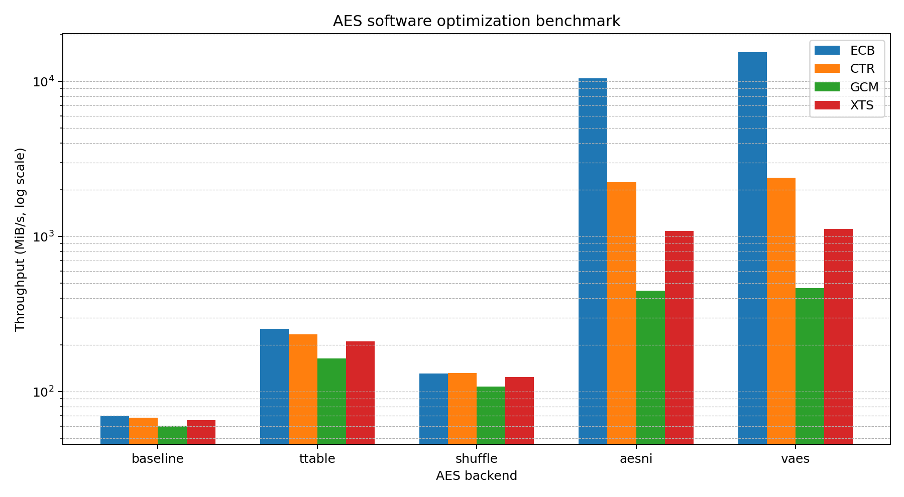

# 对称密码算法的软件实现与优化实验报告

> 姓名：__________  
> 学号：__________  
> 班级：__________  
> 实验环境：请替换为本人电脑的 CPU、操作系统、编译器和内存信息

## 一、实验目的

本实验选择 AES 作为研究对象，从轮函数的基础软件实现出发，分别实现 T-table、基于 SSSE3 shuffle 指令的向量化实现、AES-NI 实现以及 VAES/AVX2 多分组并行实现。在此基础上，进一步实现 CTR、GCM 和 XTS 三种工作模式，并针对各模式的数据并行性、有限域运算和 tweak 更新过程进行优化。

实验的主要目标如下：

1. 掌握 AES 的密钥扩展、轮变换和逆轮变换；
2. 分析查表、SIMD shuffle 和专用密码指令对执行效率的影响；
3. 理解 CTR、GCM、XTS 的结构差异和可并行优化位置；
4. 使用标准测试向量验证正确性；
5. 通过统一基准测试比较不同实现的吞吐率和加速比。

## 二、AES 算法原理

AES 的分组长度固定为 128 bit。本实验支持 128 bit 和 256 bit 密钥，对应 10 轮和 14 轮加密。AES 状态由 16 字节组成，按 4×4 字节矩阵组织。一次普通加密轮包括：

1. SubBytes：每个字节经过非线性 S 盒替换；
2. ShiftRows：状态矩阵的第 0、1、2、3 行分别循环左移 0、1、2、3 字节；
3. MixColumns：每一列在 GF(2^8) 上乘固定矩阵；
4. AddRoundKey：状态与当前轮密钥异或。

最后一轮不执行 MixColumns。解密执行对应的逆变换。

## 三、总体设计

工程将 AES 分组算法和工作模式解耦。每个 AES 后端均提供以下接口：

```c
void encrypt_block(...);
void decrypt_block(...);
void encrypt_blocks(...);
void decrypt_blocks(...);
```

CTR、GCM 和 XTS 只依赖统一接口，不关心底层使用基础实现、T-table、shuffle、AES-NI 还是 VAES。这样可以保证各方案使用同一套模式代码和测试数据，使性能比较更公平。

运行时通过 CPU 特性检测选择可用后端。若 CPU 不支持 VAES，程序不会执行 VAES 指令，而是跳过该测试项。

## 四、AES 的多种软件实现

### 4.1 基础实现

基础实现直接按照标准步骤处理 16 字节状态。SubBytes 使用 256 字节 S 盒，ShiftRows 使用临时数组重排字节，MixColumns 使用 `xtime` 完成 GF(2^8) 乘 2，再组合得到乘 3。

该实现结构清晰，适合作为正确性参考，但每轮包含大量字节操作、循环和函数级逻辑，指令数较多。

### 4.2 T-table 优化

T-table 将 SubBytes、ShiftRows 后的字节选择以及 MixColumns 的有限域乘法合并为 32 位查表。对每个输入字节预计算其在输出列四个字节位置上的贡献，得到 `Te0`、`Te1`、`Te2`、`Te3` 四张表。

普通轮中，一个输出列可以表示为四次查表、三次异或和一次轮密钥异或。与基础实现相比，有限域乘法被移到初始化阶段，因此执行速度明显提高。

T-table 的缺点是表索引依赖秘密状态，可能造成缓存侧信道泄漏，因此不适合直接作为生产环境的安全实现。

### 4.3 Shuffle 优化

Shuffle 版本使用 SSSE3 的 `PSHUFB` 指令完成字节级重排。本实验将 256 字节 S 盒划分为 16 行，每行包含 16 个字节：

- 输入字节的低 4 bit 作为 `PSHUFB` 的行内索引；
- 输入字节的高 4 bit 用于选择 16 行中的一行；
- 16 组结果通过掩码合并得到 S 盒输出。

ShiftRows 直接使用一次固定 shuffle mask 完成。MixColumns 使用 128 位 SIMD 字节加法、异或和列内旋转实现。

该方法体现了基于 shuffle 的 AES 软件实现思想。由于本实现采用通用的 16 行选择结构，而不是更复杂的 bitslice 或专门的组合逻辑，因此性能通常高于基础实现但低于 T-table。它的优点是实现直观，便于观察 `PSHUFB` 对字节置换的作用。

### 4.4 AES-NI 优化

AES-NI 提供 `AESENC`、`AESENCLAST`、`AESDEC`、`AESDECLAST` 和 `AESIMC` 等指令。一个 `AESENC` 指令能够完成一轮中的 SubBytes、ShiftRows、MixColumns 和 AddRoundKey。

本实验在单分组接口之外实现了 4 路并行加密：四个独立分组同时驻留在四个 XMM 寄存器中，每轮加载一次轮密钥并分别执行 AESENC。这样可以隐藏单条 AES 指令的延迟并提高吞吐率。

### 4.5 VAES/AVX2 优化

VAES 将 AES 轮指令扩展到 VEX/EVEX 编码。本实验使用 256 位 YMM 寄存器，每个寄存器包含两个独立的 128 位 AES 分组，并同时处理两个 YMM 寄存器，即一次循环并行处理四个分组。

与 AES-NI 相比，VAES 的主要优势体现在多分组并行场景。单个分组仍回退到 AES-NI 路径，而 ECB、CTR、GCM 的 CTR 部分和 XTS 批量分组会调用 VAES 多分组接口。

## 五、工作模式实现与优化

### 5.1 CTR 模式

CTR 模式将连续计数器分组加密，得到密钥流，再与明文异或。各计数器之间不存在依赖，因此具有天然并行性。

本实验不是逐分组调用 AES，而是一次生成最多 64 个计数器分组，随后调用 `encrypt_blocks` 批量加密。AES-NI 后端可四路并行，VAES 后端可利用 YMM 寄存器并行处理多个分组。最后一个不足 16 字节的数据块只使用密钥流的相应前缀。

### 5.2 GCM 模式

GCM 由 CTR 加密和 GHASH 认证两部分组成。对于 96 bit IV，初始计数器为：

```text
J0 = IV || 0x00000001
```

数据加密从 `inc32(J0)` 开始。认证值为 AAD、密文和长度字段经过 GHASH 后，再与 `AES_K(J0)` 异或。

本实验包含两级 GHASH 实现：

- 通用回退路径：4-bit 预计算有限域乘法；
- x86 优化路径：使用 `PCLMULQDQ` 完成 128×128 bit 无进位乘法，再按多项式 `x^128+x^7+x^2+x+1` 约减。

GCM 的 CTR 部分能够充分使用 AES-NI/VAES，但 GHASH 存在链式依赖，因此整体加速比低于纯 ECB。认证标签比较采用累积异或方式，避免在第一个不相同字节处提前返回。

### 5.3 XTS 模式

XTS 使用两个独立 AES 密钥：数据密钥 K1 和 tweak 密钥 K2。初始 tweak 为：

```text
T0 = AES_K2(tweak_input)
```

每处理一个分组，tweak 在 GF(2^128) 中乘以 α。实现中按 XTS 的小端多项式表示逐字节左移，最高位产生进位时在第 0 字节异或 `0x87`。

普通完整分组采用批量处理：先生成多个 tweak，将输入与 tweak 异或后调用 `encrypt_blocks` 或 `decrypt_blocks`，最后再异或相同 tweak。对最后不足 16 字节的情况实现 ciphertext stealing，因此输入长度只要不少于 16 字节即可。

## 六、正确性验证

测试程序对每一种可用后端执行相同测试：

1. AES-128 FIPS 197 单分组向量；
2. AES-256 FIPS 197 单分组向量；
3. NIST SP 800-38A CTR-AES128 四分组向量；
4. NIST SP 800-38D GCM-AES128 密文和认证标签向量；
5. 37 字节 AES-XTS ciphertext stealing 向量；
6. 所有模式均执行解密恢复检查。

运行结果为五种后端全部通过：

```text
[ OK ] baseline
[ OK ] ttable
[ OK ] shuffle
[ OK ] aesni
[ OK ] vaes
```

此外，工程在 AddressSanitizer 和 UndefinedBehaviorSanitizer 下运行测试，未检测到内存越界或未定义行为。

## 七、性能测试

### 7.1 测试环境

以下数据是在本次生成工程的测试环境上得到，仅作为示例。提交报告前应在本人电脑重新运行，并替换本节环境和数据。

- CPU：AMD EPYC 9V74
- 架构：x86-64
- 指令特性：SSSE3、AES-NI、PCLMULQDQ、AVX2、VAES、VPCLMULQDQ
- 编译器：GCC 14.2.0
- 构建选项：Release，`-O3`
- 数据规模：8 MiB
- 重复次数：3

### 7.2 吞吐率结果

单位：MiB/s。

| 后端 | ECB | CTR | GCM | XTS |
|---|---:|---:|---:|---:|
| baseline | 69.387 | 67.827 | 60.294 | 65.228 |
| T-table | 253.498 | 234.328 | 163.307 | 210.403 |
| shuffle | 130.632 | 132.250 | 107.761 | 123.821 |
| AES-NI | 10488.369 | 2240.254 | 447.275 | 1083.625 |
| VAES | 15392.578 | 2385.822 | 465.918 | 1116.051 |



> 图中纵轴采用对数刻度，以便同时观察几十 MiB/s 的软件实现和上万 MiB/s 的指令集实现。

### 7.3 相对基础实现的加速比

| 后端 | ECB | CTR | GCM | XTS |
|---|---:|---:|---:|---:|
| T-table | 3.65× | 3.45× | 2.71× | 3.23× |
| shuffle | 1.88× | 1.95× | 1.79× | 1.90× |
| AES-NI | 151.16× | 33.03× | 7.42× | 16.61× |
| VAES | 221.84× | 35.18× | 7.73× | 17.11× |

### 7.4 结果分析

1. **T-table 明显优于基础实现。** 它将 S 盒和 MixColumns 合并为查表，减少了逐字节有限域乘法，ECB 吞吐率约提高 3.65 倍。
2. **通用 shuffle 版本取得中等加速。** ShiftRows 和 MixColumns 得到 SIMD 化，但 16 行 S 盒选择仍需较多 shuffle、比较和掩码操作，因此没有超过 T-table。
3. **AES-NI 和 VAES 在多分组 ECB 上优势最大。** 专用指令将完整 AES 轮压缩为单条硬件指令，VAES 又扩大了并行宽度，因此 ECB 加速超过 200 倍。
4. **CTR 的加速低于 ECB。** 除 AES 轮运算外，还需要生成计数器、执行内存写入和异或，模式层开销占比上升。
5. **GCM 的瓶颈转移到 GHASH。** 即使 AES 部分使用 VAES，GHASH 仍存在前后依赖，因此整体吞吐率远低于 ECB。PCLMULQDQ 已显著提高有限域乘法速度，但没有完全消除串行依赖。
6. **XTS 通过批量 tweak 和多分组 AES 获得明显加速。** 与逐分组实现相比，AES-NI/VAES 后端可以一次处理多个经 tweak 异或后的分组。
7. **VAES 相比 AES-NI 在 ECB 上提升最明显。** 在 CTR、GCM、XTS 中，模式层开销和串行部分限制了 VAES 的额外收益，符合 Amdahl 定律。

## 八、安全性与工程讨论

### 8.1 T-table 的缓存侧信道

T-table 的访存地址由中间状态决定，攻击者可能通过缓存命中时间推测密钥相关信息。因此 T-table 虽然适合展示经典软件优化，但不应被当作现代生产环境中的首选实现。

### 8.2 Shuffle 实现的边界

本实验的 shuffle 方案主要用于展示 `PSHUFB` 在 S 盒查找和字节置换中的作用。它不是严格常数时间的高性能 bitslice 实现，性能和侧信道性质都不等同于成熟密码库中的专门实现。

### 8.3 GCM 的 IV 唯一性

GCM 在同一密钥下重复使用 IV 会重复 CTR 密钥流，并破坏认证安全性。工程 API 只负责算法计算，调用者必须保证 IV 唯一。

### 8.4 XTS 不提供认证

XTS 适合磁盘扇区加密，只提供保密性。攻击者仍可能修改密文并导致对应明文发生可控变化，因此需要完整性保护的场景不能只使用 XTS。

## 九、实验结论

本实验完成了 AES 从基础实现到多种软件优化实现的完整过程，并在统一后端接口上实现了 CTR、GCM 和 XTS。实验结果表明，T-table 能够通过空间换时间获得数倍加速；SSSE3 shuffle 可以减少字节置换和有限域操作开销；AES-NI 和 VAES 则通过专用硬件指令取得数量级提升。

不同工作模式的最终性能不仅取决于 AES 分组加密本身，还取决于计数器生成、GHASH、tweak 更新、内存访问和串行依赖。ECB 最能体现 VAES 的并行优势，而 GCM 的性能更多受 GHASH 限制。该实验说明，对称密码优化需要同时考虑算法结构、指令集、数据并行度和模式层开销。

## 十、参考资料

1. NIST, FIPS 197, Advanced Encryption Standard.
2. NIST, SP 800-38A, Recommendation for Block Cipher Modes of Operation.
3. NIST, SP 800-38D, Galois/Counter Mode and GMAC.
4. NIST, SP 800-38E, XTS-AES Mode for Confidentiality on Storage Devices.
5. Intel Intrinsics Guide.
